# Forecasting in Python with Facebook Prophet
## How to tune and optimize Prophet using domain knowledge to add greater control to your forecasts.

These are the support notebooks for my blog post about Prophet here: https://towardsdatascience.com/forecasting-in-python-with-facebook-prophet-29810eb57e66


In this repo, I explain how to forecast using Facebook’s Prophet and demonstrate a few advanced techniques for handling trend inconsistencies by using domain knowledge. There are a lot of Prophet tutorials floating around the web, but none of them went into any depth about tuning a Prophet model, or about integrating analyst knowledge to help a model navigate the data. I intend to do both of those here.

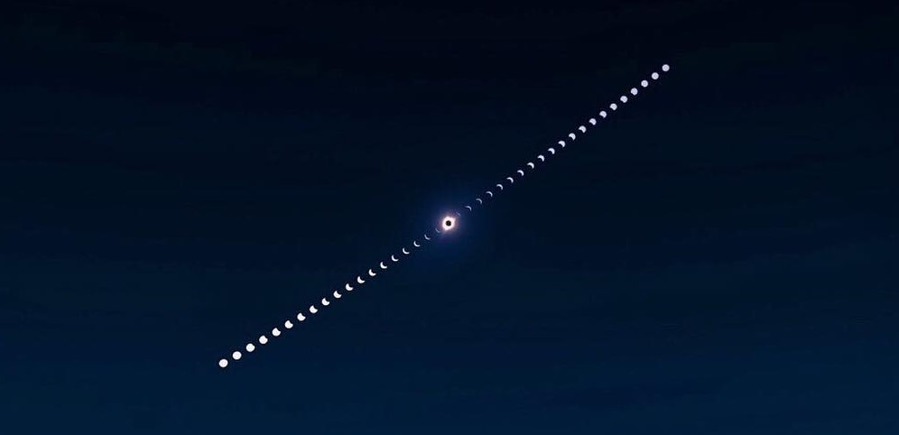
source: https://www.instagram.com/p/BaKEnIPFUq-/

In a previous story about [forecasting in Tableau](https://towardsdatascience.com/forecasting-with-python-and-tableau-dd37a218a1e5), I used a modification of the ARIMA algorithm to forecast the number of passengers on commercial flights in the United States. The ARIMA approach works decently well with stationary data and when forecasting short time frames, but Facebook’s engineers have built a tool for those cases which ARIMA can’t handle. Prophet is built with its backend in STAN, a probabilistic coding language. This allows Prophet to have many of the advantages offered by Bayesian statistics, including seasonality, the inclusion of domain knowledge, and confidence intervals to add a data-driven estimate of risk.

I’m going to look at three sources of data to illustrate how to use, and some of the advantages of, Prophet. If you want to follow along, you’ll first need to install Prophet; [Facebook’s documentation provides simple instructions](https://facebook.github.io/prophet/docs/installation.html#python). The [notebook](https://github.com/raffg/prophet_forecasting/blob/master/prophet.ipynb) I used for this article provides the full code to build the models discussed.

### Air Passengers

Let’s start out with something simple. The same Air Passengers data from my [previous article](https://towardsdatascience.com/forecasting-with-python-and-tableau-dd37a218a1e5). Prophet requires time series data to have a minimum of two columns: `ds` which is the time stamp and `y` which is the values. After loading our data, we need to format it as such:
```
passengers = pd.read_csv('data/AirPassengers.csv')
df = pd.DataFrame()
df['ds'] = pd.to_datetime(passengers['Month'])
df['y'] = passengers['#Passengers']
```
With just a few lines, Prophet can make a forecast model every bit as sophisticated as the ARIMA model I built previously. Here, I’m calling Prophet to make a 6-year forecast (frequency is monthly, periods are 12 months/year times 6 years):
```
prophet = Prophet()
prophet.fit(df)
future = prophet.make_future_dataframe(periods=12 * 6, freq='M')
forecast = prophet.predict(future)
fig = prophet.plot(forecast)
a = add_changepoints_to_plot(fig.gca(), prophet, forecast)
```

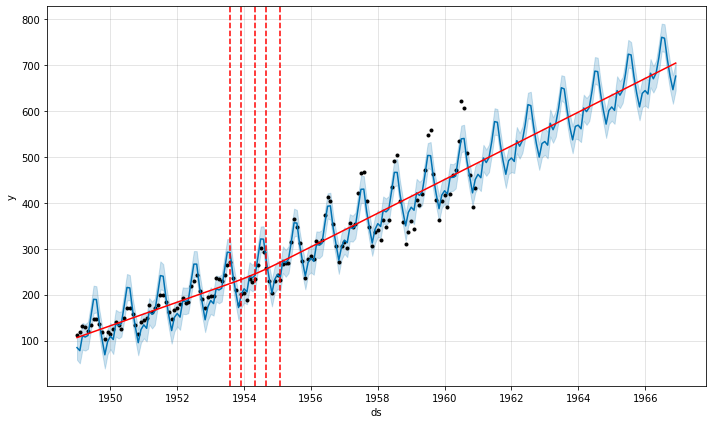
Number of passengers (in the thousands) on commercial airlines in the US

Prophet has included the original data as the black dots and the blue line is the forecast model. The light blue area is the confidence interval. Using the `add_changepoints_to_plot` function added the red lines; the vertical dashed lines are changepoints Prophet identified where the trend changed, and the solid red line is the trend with all seasonality removed. This plot format is what I’ll be using throughout this article.

With that simple case out of the way, let’s move on to more complicated data.

### Divvy Bike Share

[Divvy](https://www.divvybikes.com/) is a bike share service in Chicago. I did a project previously where I analysed their data and correlated it with weather information scraped from [Weather Underground](https://www.wunderground.com/). I knew this data exhibited strong seasonality so thought it would be a great demonstration of Prophet’s ability.

The Divvy data is on a per-ride level so to format the data for Prophet, I aggregated to the daily level and created columns for the mode of the “events” column per day (i.e., the weather conditions: `'not_clear', 'rain or snow', ‘clear', ‘cloudy', ‘tstorms', ‘unknown'`), the count of rides, and the mean of temperature.

Once formatted, let’s look at the number of rides per day:

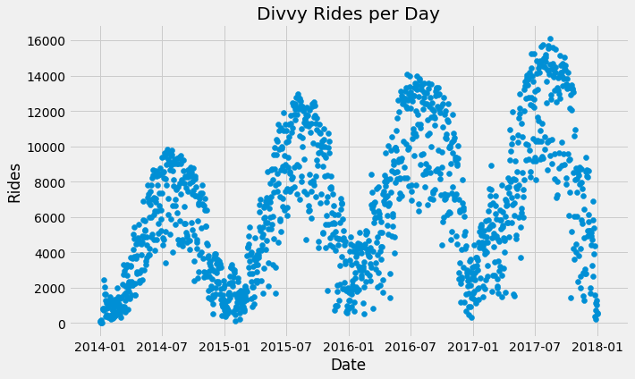

So there’s clearly a seasonality to the data, and the trend appears to be increasing with time. With this data set, I want to demonstrate how to add additional regressors, in this case the weather and temperature. Let’s look at the temperature:

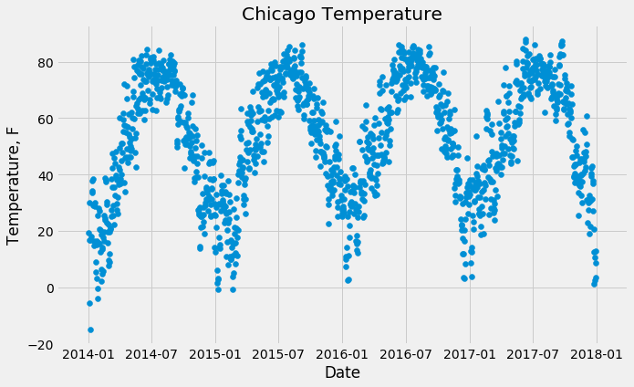

It looks a lot like the previous chart, but without the increasing trend. And this similarity makes sense because bicycle riders are going to ride more often when the weather is sunny and warm, so both plots should rise and fall in tandem.

In order to create a forecast with the addition of another regressor, it is necessary that the additional regressor have data for the forecasted period. For this reason, I’m cutting the Divvy data short a year so I can predict that year with the weather information. You can see I’m also adding Prophet’s default holidays for the US:

```
prophet = Prophet()
prophet.add_country_holidays(country_name='US')
prophet.fit(df[d['date'] < pd.to_datetime('2017-01-01')])
future = prophet.make_future_dataframe(periods=365, freq='d')
forecast = prophet.predict(future)
fig = prophet.plot(forecast)
a = add_changepoints_to_plot(fig.gca(), prophet, forecast)
plt.show()
fig2 = prophet.plot_components(forecast)
plt.show()
```

The above code block creates the trend plot as described before in the **Air Passengers** section:

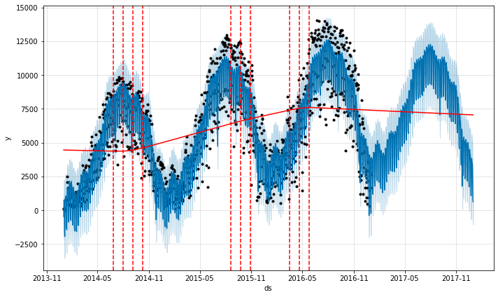

And the components plot:

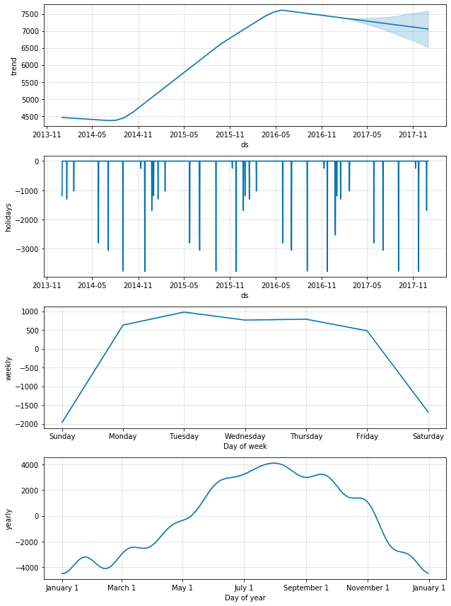

The components plot consists of 3 sections: the trend, the holidays, and the seasonality. The sum of those 3 components account for the entirety of the model in fact. The trend is simply what the data is showing if you subtract out all of the other components. The holidays plot shows the effect of all of the holidays included in the model. Holidays, as implemented in Prophet, can be thought of as unnatural events when the trend will deviate from the baseline but return once the event is over. Additional regressors, as we’ll explore below, are like holidays in that they cause the trend to deviate from the baseline, except that the trend will stay changed after the event. In this case, the holidays all result in reduced ridership, which again makes sense if we realize that a lot of these riders are commuters to work. The weekly seasonality component shows that ridership is pretty constant throughout the week, but with a steep decline on the weekend. This is the evidence that supports the theory that most riders are commuters. The final thing I want to note is that the yearly seasonality plot is quite wavy. These plots are created with Fourier transforms, essentially stacked sine waves. Clearly, the default in this case has too many degrees of freedom. In order to smooth out the curve, I’ll next create a Prophet model with the yearly seasonality turned off and an additional regressor added to account for it, but with fewer degrees of freedom. I’m also going to go ahead and add in those weather regressors in this model as well:

```
prophet = Prophet(growth='linear',
                  yearly_seasonality=False,
                  weekly_seasonality=True,
                  daily_seasonality=False,
                  holidays=None,
                  seasonality_mode='multiplicative',
                  seasonality_prior_scale=10,
                  holidays_prior_scale=10,
                  changepoint_prior_scale=.05,
                  mcmc_samples=0
                 ).add_seasonality(name='yearly',
                                    period=365.25,
                                    fourier_order=3,
                                    prior_scale=10,
                                    mode='additive')
prophet.add_country_holidays(country_name='US')
prophet.add_regressor('temp')
prophet.add_regressor('cloudy')
prophet.add_regressor('not clear')
prophet.add_regressor('rain or snow')
prophet.fit(df[df['ds'] < pd.to_datetime('2017')])
future = prophet.make_future_dataframe(periods=365, freq='D')
future['temp'] = df['temp']
future['cloudy'] = df['cloudy']
future['not clear'] = df['not clear']
future['rain or snow'] = df['rain or snow']
forecast = prophet.predict(future)
fig = prophet.plot(forecast)
a = add_changepoints_to_plot(fig.gca(), prophet, forecast)
plt.show()
fig2 = prophet.plot_components(forecast)
plt.show()
```

The trend plot looks very similar so I’ll only share the components plot:

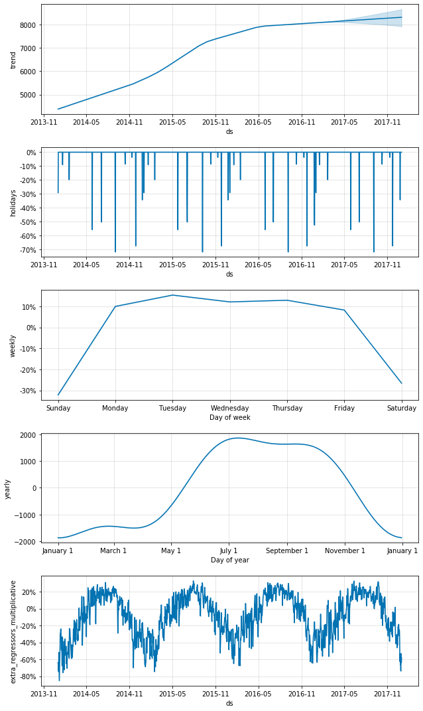

The last year of the trend is upwards in this plot, not downwards as in the previous! This is explained because the last year of data showed lower average temperatures, which reduced ridership more than expected otherwise. We also see that the yearly curve is smoothed out and there’s an additional plot: the `extra_regressors_multiplicative` plot. This shows the effect of the weather. What we’re seeing is to be expected: ridership is increased in the summer and decreased in winter, and a lot of that variability is accounted for by the weather. I want to see one more thing, just for a demonstration. I ran that above model yet again but this time only included the regressor for `rain or snow`. Here’s the components plot:

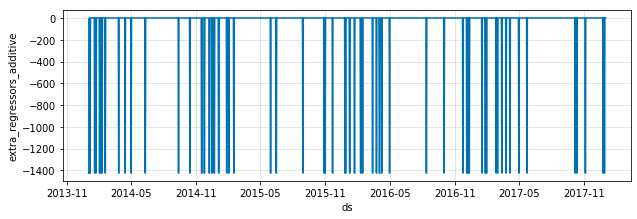

This shows that when it’s raining or snowing, there will be about 1400 fewer rides per day than otherwise. Pretty cool, right!?

Lastly, I wanted to aggregate this dataset by hour to create one more component plot, the daily seasonality. Here’s what that plot looks like:

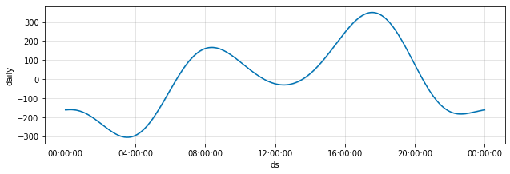

As [Rives noted, 4am is the worst possible hour to be awake](https://www.ted.com/talks/rives_the_4_a_m_mystery). Clearly, Chicago’s bicycle riders agree. There’s a local peak just after 8am though: the morning commuters; and a global peak around 6pm: the evening communters. I also see that there’s a small peak just after midnight: I like to think that this is people heading home from the bars. That’s it for Divvy data! Let’s move on to Instagram.

### Instagram

Facebook developed Prophet to analyze its own data. It only seems fair therefore to test out Prophet on a fitting data set. I scoured Instagram for a few accounts exhibiting interesting trends which I wanted to explore and then I scraped the service for all the data for three accounts: [@natgeo](https://www.instagram.com/natgeo/), [@kosh_dp](https://www.instagram.com/kosh_dp/), and [@jamesrodriguez10](@jamesrodriguez10).

#### National Geographic

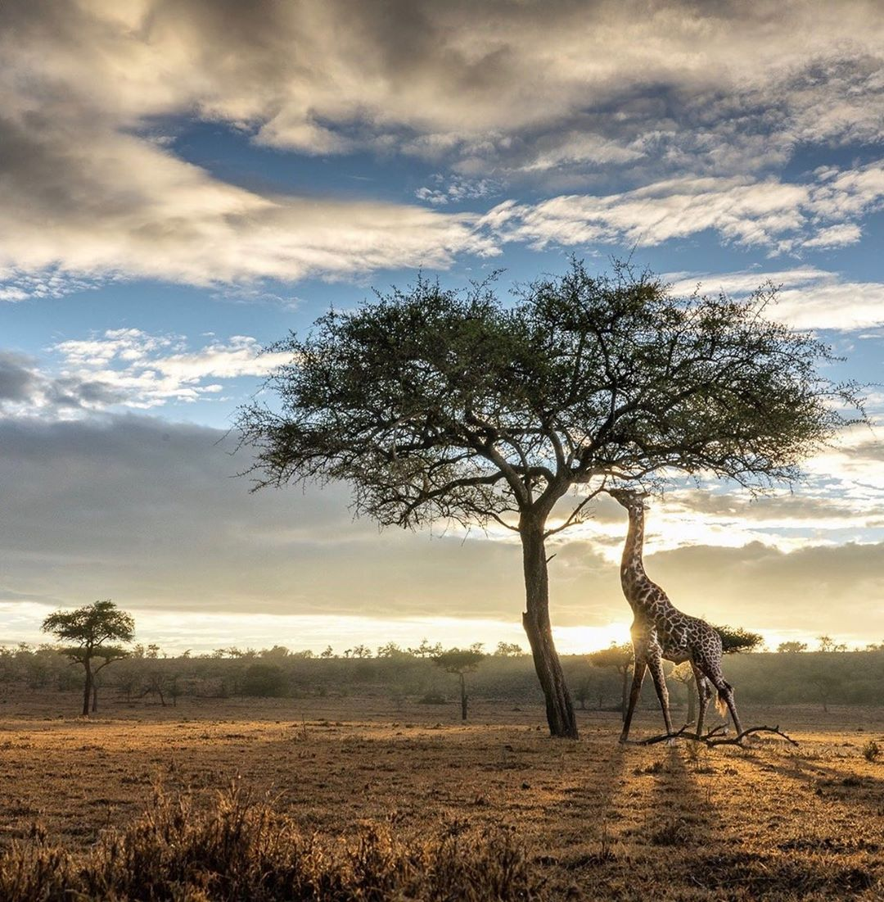
source: https://www.instagram.com/p/B5G_U_IgVKv/

In 2017, I was working on a [project](https://public.tableau.com/profile/greg4084#!/vizhome/NationalGeographiconInstagram/Storyboard) where I noticed an [anomaly](https://github.com/raffg/natgeo_instagram_anomaly) in National Geographic’s [Instagram account](https://www.instagram.com/natgeo/). For the month of August in 2016, the number of likes per photo suddenly and inexplicably increased dramatically, but then returned to the baseline as soon as the month was over. I wanted to model this spike as due to a marketing campaign during the month to increase likes, and then see if I could predict the effect of a future marketing campaign.

Here’s what Natgeo’s likes per post chart looks like. The trend is obviously increasing and there’s also increased variance over time. There are a lot of outliers with dramatically high likes, but there’s that spike in August 2016 where all photos posted during that month had likes which were much higher than the surrounding posts:

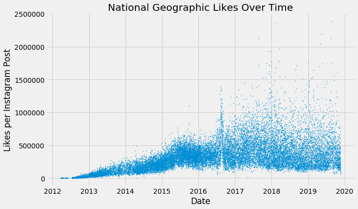

I don’t want to speculate why this could be, but for the sake of this model let’s just pretend that Natgeo’s marketing department performed some month-long campaign specifically aimed at increasing likes. First, let’s build a model ignoring this fact so we have a baseline to which we can compare:

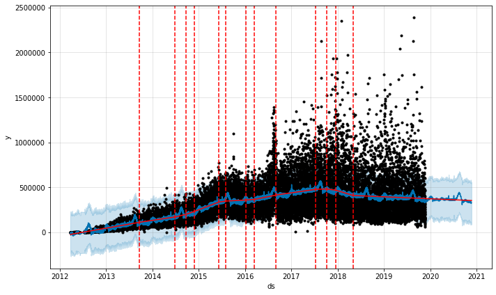

Prophet seems to be confused with that spike. It’s attempting to add it to the yearly seasonality component, as can be seen by the August spikes *each year* in the solid blue line. Prophet wants this to be a recurring event. In order to tell Prophet that something special occurred in 2016 which is not repeating in other years, let’s create a holiday for this month:

```
promo = pd.DataFrame({'holiday': "Promo event",
                      'ds' : pd.to_datetime(['2016-08-01']),
                      'lower_window': 0,
                      'upper_window': 31})
future_promo = pd.DataFrame({'holiday': "Promo event",
                      'ds' : pd.to_datetime(['2020-08-01']),
                      'lower_window': 0,
                      'upper_window': 31})
promos_hypothetical = pd.concat([promo, future_promo])
```

The `promo` dataframe contains just the August 2016 event, and the `promos_hypothetical` dataframe contains an additional promo which Natgeo is hypothetically considering for August 2020. When adding a holiday, Prophet allows for a lower window and an upper window, essentially days to include with the holiday event if you, for example, want to include Black Friday with Thanksgiving, or Christmas Eve with Christmas. I’ve added 31 days after the “holiday”, to include the whole month in the event. Here’s the code and the new trend plot. Note that I’m just sending `holidays=promo` when calling the Prophet object:

```
prophet = Prophet(holidays=promo)
prophet.add_country_holidays(country_name='US')
prophet.fit(df)
future = prophet.make_future_dataframe(periods=365, freq='D')
forecast = prophet.predict(future)
fig = prophet.plot(forecast)
a = add_changepoints_to_plot(fig.gca(), prophet, forecast)
plt.show()
fig2 = prophet.plot_components(forecast)
plt.show()
```

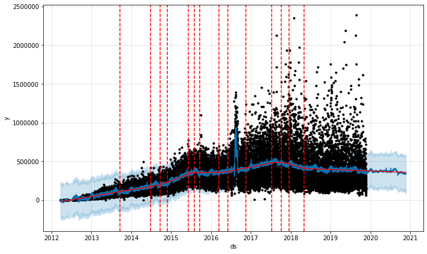

Fantastic! Now Prophet is not adding that silly August bump annually but is indeed showing a nice spike in just 2016. So now let’s run the model again, but using that `promos_hypothetical` dataframe, to estimate what would happen if Natgeo were to run an identical campaign in 2020:

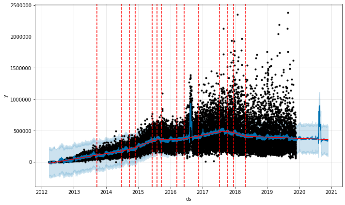

This demonstrates how to forecast behavior when adding in an unnatural event. Planned merchandise sales could be model this year, for instance. Now let’s move on to the next account.

#### Anastasia Kosh


source: https://www.instagram.com/p/BfZG2QCgL37/

[Anastasia Kosh](https://www.instagram.com/kosh_dp/) is a Russian photographer who posts whimsical self-portraits to her Instagram and makes music videos for YouTube. We were neighbors on the same street back when I lived in Moscow a few years ago; she had about 10,000 Instagram followers back then but in 2017 her YouTube account went viral in Russia and she has become something of a celebrity among tweens in Moscow. Her Instagram account has grown exponentially and is quickly approaching 1 million followers. This exponential growth seemed like a good challenge for Prophet.

This is the data we’re going to model:

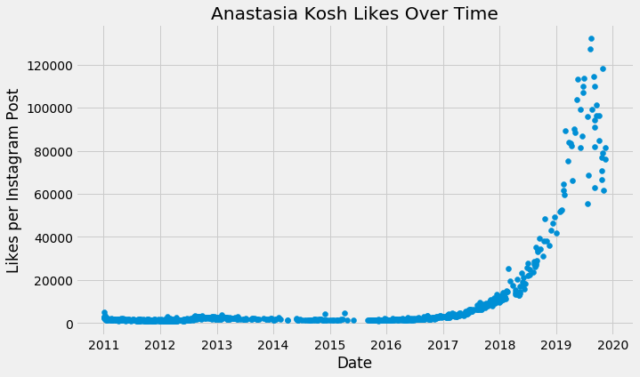

It’s the classic hockey stick shape of optimistic growth, except that in this case it’s real! Modelling it with linear growth, the same way we did the other data above, results in unrealistic forecasts:

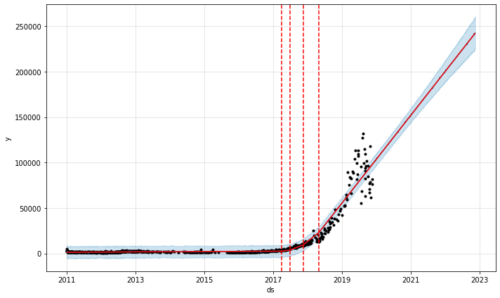

That curve will just keep going on to infinity. Obviously, there’s an upper limit to how many likes a photo on Instagram can get. Theoretically, this would be equal to the number of unique accounts on the service. But realistically, not every account will see, nor like, the photo. This is where a little bit of domain knowledge from the analyst will come in handy. I decided to model this with logistic growth, which requires that Prophet be told a ceiling (Prophet calls it a `cap`) and a floor:

```
cap = 200000
floor = 0
df['cap'] = cap
df['floor'] = floor
```

Through my own knowledge of Instagram and a little bit of trial and error, I decided upon the ceiling of 200,000 likes, and a floor of 0 likes. It’s important to note that Prophet does allow these values to be defined as functions of time, so they needn’t be constant. In this case, constant values were exactly what I needed:

```
prophet = Prophet(growth='logistic',
                  changepoint_range=0.95,
                  yearly_seasonality=False,
                  weekly_seasonality=False,
                  daily_seasonality=False,
                  seasonality_prior_scale=10,
                  changepoint_prior_scale=.01)
prophet.add_country_holidays(country_name='RU')
prophet.fit(df)
future = prophet.make_future_dataframe(periods=1460, freq='D')
future['cap'] = cap
future['floor'] = floor
forecast = prophet.predict(future)
fig = prophet.plot(forecast)
a = add_changepoints_to_plot(fig.gca(), prophet, forecast)
plt.show()
fig2 = prophet.plot_components(forecast)
plt.show()
```

I defined the growth to be logistic, turned off all seasonality (there didn’t appear to be much of it in my plots), and adjusted a few of the tuning parameters. I also added the default holidays for Russia, as that is where the majority of Anastasia’s followers are located. When calling the `.fit` method on the `df`, Prophet sees the `cap` and `floor` columns and knows to include them in the model. It’s very important though that when you create your forecast dataframe, you add these columns to it (that’s the `future` dataframe in the code block above). We’ll walk through this again in the next section. But now our trend plot looks a lot more realistic!

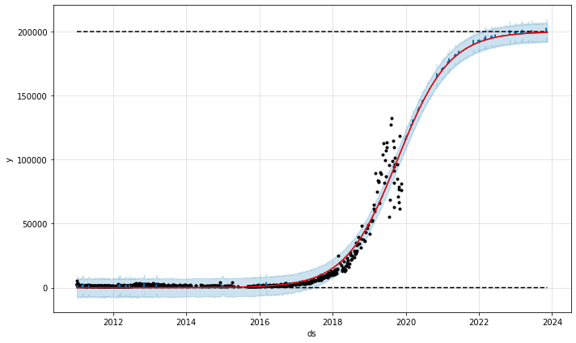

Finally, let’s look at our last example.

#### James Rodríguez


source: https://www.instagram.com/p/BySl8I7HOWa/

[James Rodríguez](https://www.instagram.com/jamesrodriguez10/) is a Colombian soccer player who was a standout performer in both the 2014 and 2018 World Cups. His Instagram account has had steady growth since its inception; but while working on a [previous analysis](https://towardsdatascience.com/the-top-50-most-followed-instagrammers-visualized-134ca4788938), I noticed that during the two World Cups his account saw sudden and lasting spikes in followers. In contrast to the spikes in National Geographic’s account, which could be modeled as a holiday, Rodríguez’s growth did not return to the baseline after the two tournaments but redefined a new baseline. This is fundamentally different behavior and will require a different modelling approach to capture it.

This is what James Rodríguez’s’s likes per photo looks like throughout the account lifetime:

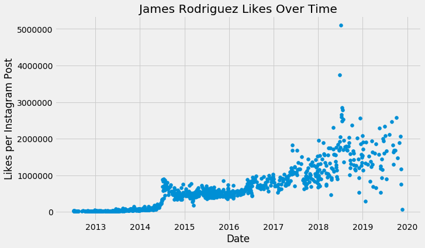

This is going to be difficult to model cleanly with only the techniques we’ve used so far in this tutorial. He experienced an increase in the trend baseline during the first World Cup in the summer of 2014, and then a spike, and potentially a changed baseline, during the second World Cup in the summer of 2018. Modelling this behavior with the default model doesn’t quite work:

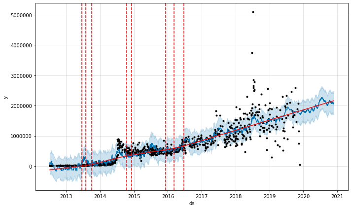

It’s not a **terrible** model; it just doesn’t neatly model the behavior around those two World Cup tournaments. If, as we did with Anastasia Kosh’s data above, we model those tournaments as holidays, we do see an improvement in the model:

```
wc_2014 = pd.DataFrame({'holiday': "World Cup 2014",
                      'ds' : pd.to_datetime(['2014-06-12']),
                      'lower_window': 0,
                      'upper_window': 40})
wc_2018 = pd.DataFrame({'holiday': "World Cup 2018",
                      'ds' : pd.to_datetime(['2018-06-14']),
                      'lower_window': 0,
                      'upper_window': 40})
world_cup = pd.concat([wc_2014, wc_2018])
prophet = Prophet(yearly_seasonality=False,
                  weekly_seasonality=False,
                  daily_seasonality=False,
                  holidays=world_cup,
                  changepoint_prior_scale=.1)
prophet.fit(df)
future = prophet.make_future_dataframe(periods=365, freq='D')
forecast = prophet.predict(future)
fig = prophet.plot(forecast)
a = add_changepoints_to_plot(fig.gca(), prophet, forecast)
plt.show()
fig2 = prophet.plot_components(forecast)
plt.show()
```

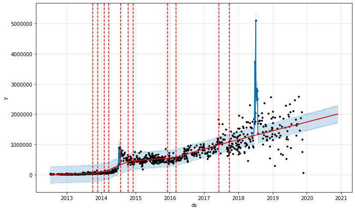

I still don’t like how slow the model is to adapt to the changed trendline, especially around the 2014 World Cup. It’s just too smooth of a transition. By adding additional regressors though, we can force Prophet to consider an abrupt change.

In this case, I’m defining two periods for each tournament, during and after. Modelling it this way assumes that before the tournament, there will be a certain trend line, during the tournament there will be a linear change to that trend line, and after the tournament, there will be yet another change. I define these periods as either 0 or 1, on or off, and let Prophet train itself on the data to learn the magnitudes:

```
df['during_world_cup_2014'] = 0
df.loc[(df['ds'] >= pd.to_datetime('2014-05-02')) & (df['ds'] <= pd.to_datetime('2014-08-25')), 'during_world_cup_2014'] = 1
df['after_world_cup_2014'] = 0
df.loc[(df['ds'] >= pd.to_datetime('2014-08-25')), 'after_world_cup_2014'] = 1
df['during_world_cup_2018'] = 0
df.loc[(df['ds'] >= pd.to_datetime('2018-06-04')) & (df['ds'] <= pd.to_datetime('2018-07-03')), 'during_world_cup_2018'] = 1
df['after_world_cup_2018'] = 0
df.loc[(df['ds'] >= pd.to_datetime('2018-07-03')), 'after_world_cup_2018'] = 1
```

Note where I’m updating the `future` dataframe to include these “holiday” events below:

```
prophet = Prophet(yearly_seasonality=False,
                  weekly_seasonality=False,
                  daily_seasonality=False,
                  holidays=world_cup,
                  changepoint_prior_scale=.1)
prophet.add_regressor('during_world_cup_2014', mode='additive')
prophet.add_regressor('after_world_cup_2014', mode='additive')
prophet.add_regressor('during_world_cup_2018', mode='additive')
prophet.add_regressor('after_world_cup_2018', mode='additive')
prophet.fit(df)
future = prophet.make_future_dataframe(periods=365)
future['during_world_cup_2014'] = 0
future.loc[(future['ds'] >= pd.to_datetime('2014-05-02')) & (future['ds'] <= pd.to_datetime('2014-08-25')), 'during_world_cup_2014'] = 1
future['after_world_cup_2014'] = 0
future.loc[(future['ds'] >= pd.to_datetime('2014-08-25')), 'after_world_cup_2014'] = 1
future['during_world_cup_2018'] = 0
future.loc[(future['ds'] >= pd.to_datetime('2018-06-04')) & (future['ds'] <= pd.to_datetime('2018-07-03')), 'during_world_cup_2018'] = 1
future['after_world_cup_2018'] = 0
future.loc[(future['ds'] >= pd.to_datetime('2018-07-03')), 'after_world_cup_2018'] = 1
forecast = prophet.predict(future)
fig = prophet.plot(forecast)
a = add_changepoints_to_plot(fig.gca(), prophet, forecast)
plt.show()
fig2 = prophet.plot_components(forecast)
plt.show()
```

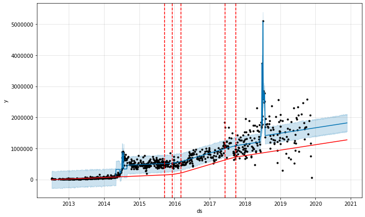

Here, the blue line is what we should be looking at. The red line shows just the trend, with the influence of the additional regressors and holidays subtracted out. Look how the blue trend line takes sharp jumps during the World Cups. That’s exactly the behavior our domain knowledge tells us would happen! After Rodríguez scored his first World Cup goal, suddenly thousands of new followers arrived on his account. Let’s take a look at the component plot, just to see what specific effect of these additional regressors:

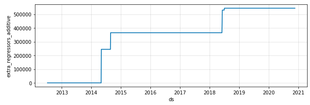

This tells us that in 2013 and the beginning of 2014, the World Cup had no effect on Rodríguez’s likes per photo. During the 2014 World Cup, there was a dramatic uptick in his average like per photo which continued after the tournament was over (this can be explained because he gained so many active followers during the event). There was a similar, but less dramatic, event during the 2018 World Cup, presumably because by this point there weren’t as many soccer fans left to discover his account and follow him.